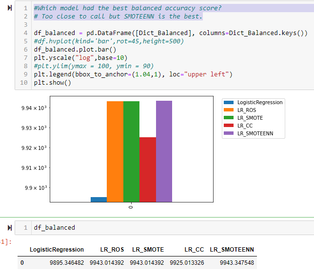
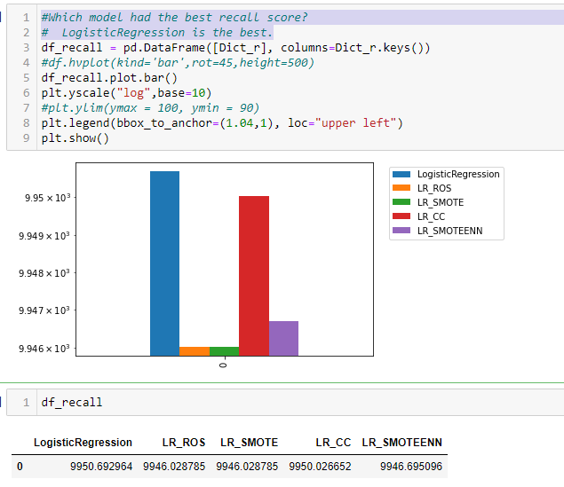
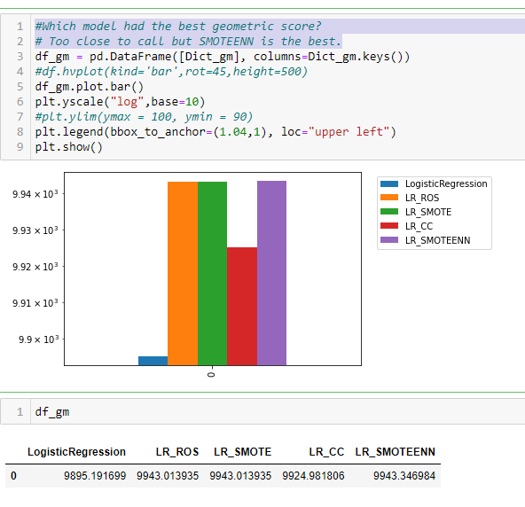
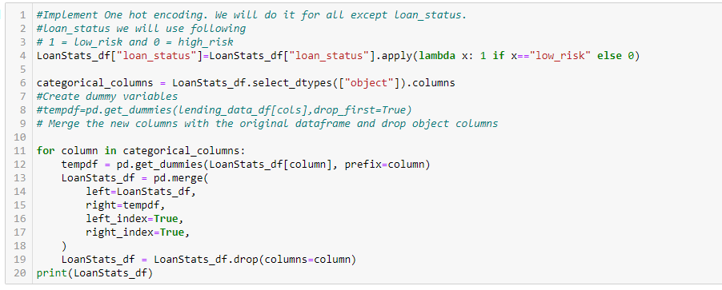
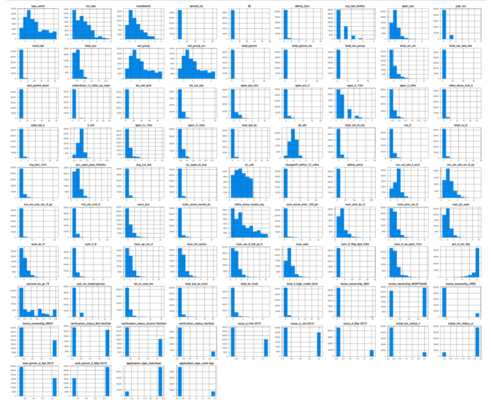
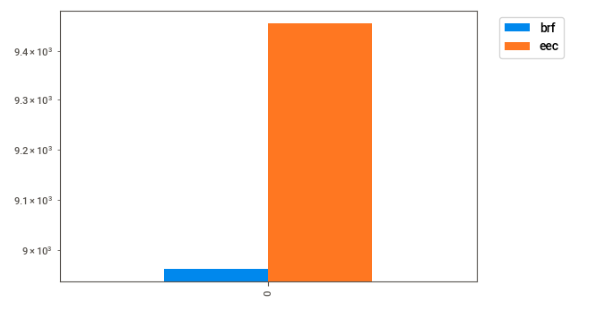
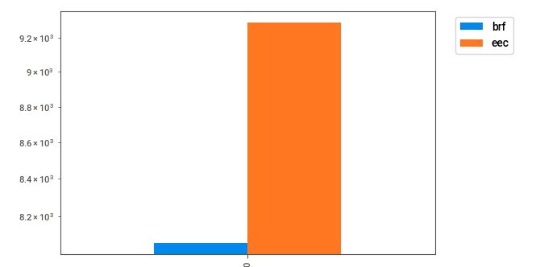

### Risk classification using Supervised classification models.

---

---

In this project we have used various classification models on a imbalanced data set for assessing risk for granting loans.
The project has been split in two notebooks.
- *Credit_Risk_Resampling.ipynb*
- *Credit_Risk_Ensemble.ipynb*

**Credit_Risk_Resampling**, in this notebook we have analyzed the lending_data.csv data. We have used simple logistic regression and then considering that the data is imbalanced for the target variable, we have used oversampling, undersampling and combined sampling and then applied logistic regression.
Some of the sampling methods applied are -

- Naive Random Oversampler and SMOTE algorithms
- Cluster Centroids algorithm undersmpling
- Over- and undersample using a combination SMOTEENN algorithm

We use balanced_accuracy_score, confusion_matrix and classification_report to asses the quality of the models and in the end compare and answer few questions.

#### Exploratory Data Analysis and Model generation.

We use Pandas, hvplot and pandas_profiler to do exploratory data analysis.

For categorical values and the target value, we did encoding -

Output of summary of profile after EDA and transformation

**Results**

*Which model had the best balanced accuracy score?*
Too close to call but SMOTEENN is the best.

     
*Which model had the best recall score?*
LogisticRegression is the best.
     

*Which model had the best geometric score?*
Too close to call but SMOTEENN is the best.

---

**Credit_Risk_Ensemble.ipynb**, in this notebook we have analyzed the LoanStats_2019Q1.csv data. We have used Balanced Random forest considering that the data is imbalanced for the target variable. In addition we have also used Easy Ensemble classifier.

We use balanced_accuracy_score, confusion_matrix and imbalanced classification report to asses the quality of the models and in the end compare and answer few questions.

#### Exploratory Data Analysis and Model generation.

We use Pandas, hvplot and pandas_profiler to do exploratory data analysis.

For categorical values and the target value, we did encoding -

Output of summary of profile after EDA and transformation and scaling

**Results**

*Which model had the best balanced accuracy score?*
Easy Ensemble Classifier is better option.

     
*Which model had the best recall score?*
Easy Ensemble Classifier is better option
     

*Which model had the best geometric score?*
Easy Ensemble Classifier is better option

*What are the top three features for Balanced Random Classifier model?*
- last_pymnt_amnt: 7.34% 
- total_rec_prncp: 6.99%
- total_pymnt_inv: 6.57%
---

